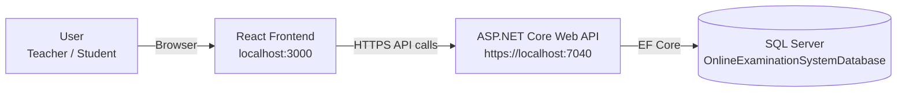
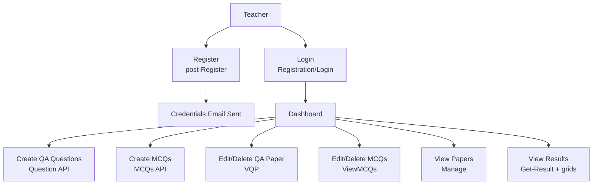

# Online Examination System (FYP) - Technical Documentation

## 1) Project Overview

This repository contains an **Online Examination System** with two major parts:

- **Frontend (Web UI):** React (MatX React admin template) located in `src/` and `public/`
- **Backend (API):** ASP.NET Core Web API (.NET 6) located in `Learning/Learning/Learning/`

The system supports two primary user roles:

- **Teacher:** creates and maintains question papers (MCQs + Question/Answer) and views results
- **Student:** attempts MCQs + Question/Answer exams and views own results


## 2) Features Provided (Functional Scope)

### 2.1 Authentication & Users
- **User Registration (Teacher/Student):** creates an account with profile fields (type, username, age, email, password, country, city).
- **Login (Teacher/Student):** validates username + password + type against the database.
- **Session Persistence (Frontend):** stores `loginUserId`, `accessToken`, `userData`, and selected `User` type in `localStorage`.
- **Email on Registration (Backend):** sends credentials email to the registered email address (SMTP via Gmail).

### 2.2 Teacher Features
- **Create Question/Answer (QA) Questions**
  - Fields: subject/course, question, model answer, marks, and up to 5 keywords.
- **Create MCQs**
  - Fields: subject/course, question, options A-D, correct answer, marks.
- **Update / Edit Question Paper**
  - QA questions: update question, answer, keywords, and marks; delete questions.
  - MCQs: update question/options/correct answer/marks; delete MCQs.
- **View Question Papers**
  - View QA paper (read-only grid)
  - View MCQs paper (read-only grid)
- **View Results (All Students)**
  - Teacher sees consolidated results for all registered users.

### 2.3 Student Features
- **Attempt QA Exam**
  - Fetches QA questions from the API and presents one question at a time.
  - Student types an answer and proceeds question-by-question.
  - **Auto-marking** using keyword matching (partial marks) and full marks for exact matches.
  - **Basic anti-cheat behavior:** if the browser tab becomes hidden, the app alerts the student and triggers the result modal.
- **Attempt MCQ Exam**
  - Fetches MCQs from the API and presents one question at a time.
  - Select one option, proceed to next question, and submit at the end.
  - Auto-marking by comparing selected option to `correctAnswer`.
- **View Results (Self)**
  - Student sees only their own consolidated results.
- **Exam Rules Page**
  - Displays examination rules/instructions.


## 3) Application Flow (Teacher vs Student)

### 3.1 Teacher Flow (High-Level)
1. **Register** (as Teacher) -> receives credentials email
2. **Login** (choose "Teacher" on login page)
3. **Upload Exam**
   - Add QA questions (`/Examination/QA`)
   - Add MCQs (`/Examination/MCQs`)
4. **Maintain Question Papers**
   - Edit/Delete QA questions (`/Examination/VQP`)
   - Edit/Delete MCQs (`/Examination/ViewMCQs`)
5. **Manage (View Papers)**
   - View QA paper (`/Manage/ViewQAExam`)
   - View MCQs paper (`/Manage/ViewMCQExam`)
6. **View Results**
   - Consolidated results grid (`/Result/Result`)

### 3.2 Student Flow (High-Level)
1. **Register** (as Student) -> receives credentials email
2. **Login** (choose "Student" on login page)
3. **Read Exam Rules** (`/ExamRules/ExamRules`)
4. **Attempt Exam**
   - Attempt QA (`/AttemptExam/AttemptQA`) -> submits -> marks saved
   - Attempt MCQs (`/AttemptExam/AttemptMCQs`) -> submits -> marks saved
5. **View Results (Self)** (`/Result/Result`)


## 4) Flow Diagrams (Mermaid)

### 4.1 System Architecture


### 4.2 Teacher Workflow


### 4.3 Student Workflow
```mermaid
flowchart TD
  S[Student] --> R[Register<br/>post-Register]
  R --> E[Credentials Email Sent]
  S --> L[Login<br/>Registration/Login]
  L --> RULES[Read Rules<br/>ExamRules]
  L --> QA[Attempt QA Exam<br/>get-question]
  QA --> QAMARK[Auto-mark + Save<br/>Post-QAMarks]
  L --> MCQ[Attempt MCQs Exam<br/>Get-MCQs]
  MCQ --> MCQMARK[Auto-mark + Save<br/>Post-MCQsMarks]
  QAMARK --> RES[View Results<br/>Get-Result (filtered by user)]
  MCQMARK --> RES
```


## 5) Technical Architecture

### 5.1 Frontend (React)

**Tech**
- React 17 + React Router v6
- Material UI (MUI) + Ant Design modals in some pages
- Axios for API requests
- MatX React layout/components (`src/app/components/MatxLayout`)

**Routes**
- App routes are defined in:
  - `src/app/routes.jsx`
  - `src/app/views/BasePage.js`
  - `src/app/views/sessions/SessionRoutes.js`

**Navigation (Sidebar)**
- Menu items are defined in `src/app/navigations.js`
  - Upload Exam (QA, MCQs, Update QA paper, Update MCQs)
  - Manage (view papers)
  - Attempt Exam (QA, MCQs)
  - View Result
  - Rules

**Role behavior**
- Login page stores selected role in `localStorage` under key `User` (Student/Teacher).
- Navigation contains commented role-based hiding logic; role-based route protection is not enforced in `AuthGuard` by default.

### 5.2 Backend (ASP.NET Core Web API)

**Tech**
- .NET 6 Web API
- Entity Framework Core 6
- SQL Server provider
- Swagger enabled for development

**API Base URLs (launch settings)**
- HTTPS: `https://localhost:7040`
- HTTP: `http://localhost:5242`

**CORS**
- Configured to allow the React dev server origin: `http://localhost:3000`


## 6) Database Design (Entities)

Entity classes are defined under `Learning/Learning/Learning/Models/` and registered in EF Core DbContext `Learning/Learning/Learning/Data/QuestionAPIDbcontext.cs`.

### 6.1 Tables / Entities

**Register**
- `ID` (Guid)
- `Type` (Teacher/Student)
- `UserName`, `Age`, `Email`, `Password`, `Country`, `City`

**QuestionAnswer** (QA paper)
- `ID` (int)
- `course`, `Question`, `Answer`
- `Keyword1..Keyword5`
- `marks`
- `Created` (DateTime)

**MCQs**
- `Id` (int)
- `course`, `Question`
- `OptionA..OptionD`, `CorrectAnswer`
- `marks`

**QAMarks**
- `ID` (Guid)
- `RegisterID` (Guid) -> navigation property `Register`
- `QMarks` (float), `TotalMarks` (int), `course` (string)

**MCQmarks**
- `ID` (Guid)
- `RegisterID` (Guid) -> navigation property `Register`
- `MCQMarks` (int), `TotalMarks` (int), `course` (string)

**Result**
- `Id` (int)
- Lists of `Register`, `QAMarks`, `MCQmarks` (used as a combined response model)


## 7) API Endpoints (Backend)

Base: `https://localhost:7040`

### 7.1 Registration / Login
- `GET  /api/Registration/Get-Register` - list registered users
- `POST /api/Registration/post-Register` - register a user (Teacher/Student) + send credential email
- `POST /api/Registration/Login` - login by `userName`, `password`, `type`

### 7.2 Question/Answer (QA)
- `GET    /api/Question/get-question` - list QA questions
- `POST   /api/Question` - create QA question
- `PUT    /api/Question/{id}` - update QA question
- `DELETE /api/Question/{id}` - delete QA question

### 7.3 MCQs
- `GET    /api/MCQs/Get-MCQs` - list MCQs
- `POST   /api/MCQs/post-MCQs` - create MCQ
- `PUT    /api/MCQs/{id}` - update MCQ
- `DELETE /api/MCQs/{id}` - delete MCQ

### 7.4 Marks (Saving Exam Attempts)
- `GET  /api/QAmarks/Get-QAMarks` - list QA marks (includes `Register`)
- `POST /api/QAmarks/Post-QAMarks` - save QA marks for a user
- `GET  /api/QAmarks/Get-MCQsMarks` - list MCQ marks (includes `Register`)
- `POST /api/QAmarks/Post-MCQsMarks` - save MCQ marks for a user

### 7.5 Result (Combined)
- `GET /Get-Result` - returns combined dataset (Register + QAMarks + MCQmarks)

Note: the frontend consolidates results client-side by merging marks for each `RegisterID`.


## 8) Exam Marking Logic (Frontend)

### 8.1 MCQ Marking
- Each question carries a `marks` value.
- If `selectedOption === correctAnswer` -> add that question's marks, else add 0.
- On final submit, frontend posts a summary object to `POST /api/QAmarks/Post-MCQsMarks`.

### 8.2 QA Marking
The QA attempt screen compares the student answer to the stored keywords and answer:
- If **all 5 keywords are found** in the student's answer OR the answer matches exactly -> full marks.
- Otherwise, partial marks are computed as: `(questionMarks / numberOfNonEmptyKeywords) * matchedKeywordsCount`.
- On final submit, frontend posts a summary object to `POST /api/QAmarks/Post-QAMarks`.


## 9) Running the Project (Local Development)

### 9.1 Backend (API)
Prerequisites:
- .NET SDK 6
- SQL Server (or update the connection string)

Steps:
1. Open `Learning/Learning/Learning/appsettings.json` and set `ConnectionStrings:QuestionApiConnectionString` for your SQL Server instance.
2. Run the API:
   - From `Learning/Learning/Learning/`: `dotnet run`
3. Swagger UI (dev): `https://localhost:7040/swagger`

### 9.2 Frontend (React)
Prerequisites:
- Node.js + npm

Steps:
1. Install dependencies: `npm install`
2. Start: `npm start`
3. Frontend runs on: `http://localhost:3000`


## 10) Notes / Known Limitations (Current Implementation)

- **Role-based access control is mostly UI-driven** (via `localStorage`) and not strictly enforced at route/API level.
- **Passwords are stored in plain text** in `Register` (no hashing).
- The frontend uses localStorage keys like `loginUserId` as a session marker; there is no server-side JWT validation middleware in the API.
- Results are **computed/merged on the frontend** from `/Get-Result` rather than served as an aggregated endpoint.
